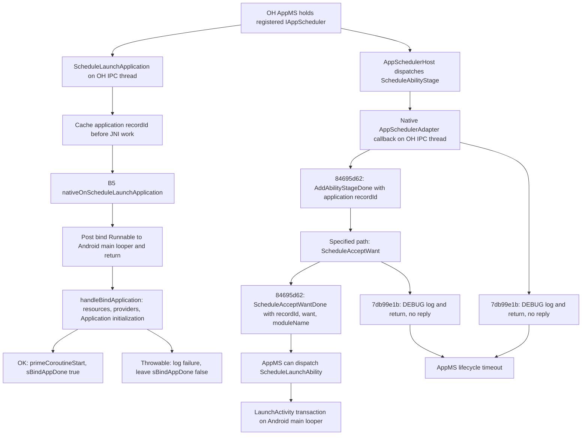

# Item 62: AbilityStage replies are native and independent of Java bind

**The common handshake gap is consistent with a native bridge generation that never sends the replies, not with a Java bind exception skipping them.** All nine #48 target logs have **49/49 JNI registration addresses matching the function-entry layout of `7db99e1b…`**, whose `ScheduleAbilityStage` and `ScheduleAcceptWant` only tail-call DEBUG logging. HelloWorld has **50/50 matching `84695d62…`**, whose two callbacks send the completion IPCs. The current source already contains those repairs. B5 `250958dc…` binds on Android's main looper and has no AbilityStage completion call in that binding path. Evidence and uncertainty are separated below.

This corrects a premise in the question: the successful HelloWorld trace proves **ability delivery**, not that it exercised/completed an AbilityStage handshake. It has no observed stage-entry/reply marker and follows a different launch context. Do not use HelloWorld alone as coverage for the specified-ability path.

## Evidence identities

Analysis base: `fc84d838`. No device commands, VM writes, runtime edits, build/deployment or commit. Inputs are opened read-only; baksmali output is generated under `/tmp/task62-smali/`. [ability-stage-results.json](ability-stage-results.json) records full source hashes, native callback symbols, tool hashes and every compared registration with original log line.

| Input | Full SHA-256 / role |
|---|---|
| Supplied B5 `vm-copies/b5-runtime-jar/oh-adapter-runtime.jar` | `250958dc3f133b67fb38c5da3caf81714fd6958e2247556e327d917b1f0d3146`; independently disassembled, no substitution |
| Native reply implementation | `84695d62f515cfec6bb317c959ec55b1d5085bf82303f792a764cf549a22267a`; `bms-deploy/bms/src/.work/b6-task52/baseline-native/liboh_adapter_bridge.so` |
| Native no-reply implementation | `7db99e1b760cf843b1a99db1382a3299f189c8cbca786ec411b7c35a2af6ffb9`; existing local `westlake-harness-t3/.../scratchpad/5cd/liboh_adapter_bridge.so`, full path in JSON; this is a comparison specimen, not a fresh #48 readback |
| Supplemental OH dispatcher specimen | `6ae44a9ca22305a58e78eb93b3cc118abe51a585ffa3a7c98b6dd380f5ff4cc7`; `b6-latest/platform-link/libapp_manager.z.so`; used to inspect callback dispatch, not asserted as a fresh #48 process hash |
| Logs | Same hash-pinned HelloWorld and nine #48 PID streams as [README](README.md); VM copies are under `/Users/zhaoyue/orca/workspaces/vm-copies/b4-48-unknown22-61b-20260929T1015/` |

There is historical corroboration for `84695d62`: `spawn-ab/evidence/readback/parent-runtime-and-sandbox.txt:71` records it, and HelloWorld's `child-25183-maps.txt:1276–1279` maps the bridge at `0x7f07d80000`. Earlier 61b `evidence/61b06572/zigzag/envstamp.txt:12` also records that hash. **That older 61b stamp must not be reused as the #48 child identity**: #48 registration addresses disagree. A reboot/overlay/namespace change is an investigation lead, not established here.

## Receiver, thread and completion path

In the following source references, `S/` is `bms/src/adapter/framework/`. Numbered snapshots are in [evidence/ability-stage](evidence/ability-stage/). `B5:N` means the original line in the regenerated `AppSchedulerBridge.smali`, retained with that number in [b5-bridge-smali.txt](evidence/ability-stage/b5-bridge-smali.txt). It is a smali-file line, distinct from the `.line` Java debug number.



This graph expresses the handshake dependencies for the specified path; it does not assert that every launch, including this HelloWorld run, traverses every node. The bind branch is independent of the two native completion calls.

1. **Who receives:** `AppSchedulerAdapter` derives from OH `AppSchedulerHost` (`S/activity/jni/app_scheduler_adapter.h:26`). `OHAppMgrClient::attachApplication` constructs that native stub and registers it through `proxy_->AttachApplication(appScheduler_)` (`S/activity/jni/oh_app_mgr_client.cpp:89–112`). OH's remote dispatcher calls the overridden native `ScheduleAbilityStage`, not Java `onScheduleAbilityStage`.
2. **Where OH dispatch lands:** the supplemental dispatcher calls the IAppScheduler virtual slot `+0x70` for stage and `+0xa8` for accept-want ([platform-dispatch.txt](evidence/ability-stage/platform-dispatch.txt), addresses `0xf3378–0xf3388` and `0xf352c–0xf3540`). Both inspected bridges have an IAppScheduler secondary vtable address point at `+0x208`, with the appropriate thunks at `+0x278` and `+0x2b0` (JSON `callback_slots`). These inspected slots agree; a missing implementation is demonstrable without inventing a vtable mismatch. Failed parcel decoding remains a separate possible pre-callback failure.
3. **Where completion is sent:** current `S/activity/jni/app_scheduler_adapter.cpp:448–460` directly invokes `OHAppMgrClient::addAbilityStageDone`; `S/activity/jni/oh_app_mgr_client.cpp:169–175` sends `IAppMgr::AddAbilityStageDone(recordId_)`. The specified-ability companion is `app_scheduler_adapter.cpp:838–850` → `oh_app_mgr_client.cpp:182–190` → `ScheduleAcceptWantDone(recordId_, want, moduleName)`.
4. **Which thread:** these current native callbacks do not post a Handler task, enter Java, take `jni_mutex_`, or test `sBindAppDone`; they send the reverse IPC on the receiving OH IPC thread. Actual stage-callback TIDs are not visible in #48, so this is code behavior, not a fabricated observed TID. By contrast, the logged launch-application callback runs on binder TIDs (e.g. STK 26304) and B5 explicitly posts its binding task to main TID 26286.
5. **Actual prerequisites:** an IPC request must reach the callback, the native AppMgr singleton must still be connected with non-null `proxy_`, and `recordId_` must identify the application record. `ScheduleLaunchApplication` caches `data.GetRecordId()` at `app_scheduler_adapter.cpp:343–349`, **before** JNI reference checks and locking at `:351–362`. The helper only guards connection/proxy; it does not presently validate the default `recordId_=-1` (`oh_app_mgr_client.h:105,122`). No resource/Provider/Application success predicate controls the stage reply.
6. **What appspawn-x does:** `S/appspawn-x/src/appspawnx_runtime.cpp:700–724` registers manifest/system-property/foreground-notification JNI methods. That registration is not an AbilityStage receiver or completion. `nativeNotifyApplicationForegrounded` is a separate foreground-state IPC, implemented at `S/activity/jni/oh_ability_manager_client.cpp:852–859` and `oh_app_mgr_client.cpp:148–150`; it must not be substituted for `AddAbilityStageDone`.

## What the B5 bytecode does on bind failure

B5 `nativeOnScheduleLaunchApplication` gets the main looper, constructs a Handler and posts `AppSchedulerBridge$2` (B5:6717, 6766–6778). If no main looper exists, it has a degraded inline fallback (B5:6721–6733). **All nine #48 logs show the normal posted/main-run path**, so that fallback does not explain these observations.

The Runnable calls `ensureBindApplication`, catches/logs any escaping Throwable, and returns ([b5-bind-runnable-smali.txt](evidence/ability-stage/b5-bind-runnable-smali.txt), original lines 51–105). `ensureBindApplication` reflectively invokes `ActivityThread.handleBindApplication` (B5:3721–3744, Java debug line 311). On normal return it logs OK, calls `primeCoroutineStart`, then stores `sBindAppDone=true` (B5:3749–3759). The failure branch prints the exception and returns without that store (B5:3765–3809).

Thus a bind exception **does skip the bind-success state update** and can leave Android application initialization incomplete. The #48 provider/classloader stacks establish real failures inside that work (e.g. OONI `hilog.txt:24292–24306`, Etar `:27375–27384`). However, **there is no AbilityStage completion call in either the normal or exceptional B5 binding path**. It cannot skip a reply that lives in an independent native callback. STK/Mindustry further disprove “bind failure is necessary”: bind returns OK at STK:33894 / Mindustry:33759 and launch still does not arrive.

`primeCoroutineStart` catches its optional class lookup failure itself (B5:7547–7585); the `(non-fatal)` messages at STK:33896 / Mindustry:33761 do not take the bind-failure branch. Java `onScheduleAbilityStage` and `onScheduleAcceptWant` are log-only methods (B5:8871–8895), but the inspected native callback implementations do **not** call them. Adding a reply to those unused Java helpers would not repair this native route.

There is also a source-generation trap: current `S/activity/java/AppSchedulerBridge.java:97–119` calls bind inline, while the pinned B5 bytecode posts it. Rebuilding the JAR from current source would change that threading behavior. This task's native repair should preserve the B5 JAR; source/JAR parity requires a separate deliberate change.

## The native break is in the actual callback bodies

| Callback | `7db99e1b` specimen | `84695d62` specimen / current repair |
|---|---|---|
| `ScheduleAbilityStage` | At `0xc8044`, 0x24-byte body only sets DEBUG log arguments and tail-branches to `HiLogPrint` at `0xc8064`; no completion IPC | At `0xc4430`, logs INFO, gets AppMgr client and tail-calls `addAbilityStageDone` at `0xc4478` |
| `ScheduleAcceptWant` | At `0xcae58`, 0x34-byte body only logs module name at DEBUG and tail-branches to `HiLogPrint` at `0xcae88`; no completion IPC | At `0xc7268`, gets AppMgr client and tail-calls `scheduleAcceptWantDone` at `0xc72c4` |

Full bodies: [no_reply-native.txt:6](evidence/ability-stage/no_reply-native.txt) and [reply-native.txt:6](evidence/ability-stage/reply-native.txt); helper implementations are also retained in the latter at lines 32 and 107. In the no-reply specimen the missing calls are unconditional: **even a successful bind cannot make them appear**. The no-op entry uses HiLog level 3 (DEBUG); an INFO-level capture can hide the callback's only message. The logs alone therefore cannot establish “the callback was never entered.”

The local current source has the reply logic already (`app_scheduler_adapter.cpp:448–460,838–850`). This is a **compiled-generation/source-parity repair**, not a request to add a second reply on top of the existing implementation.

## Matching native layout to each historical log

Method: take the logged `nativeNotifyApplicationForegrounded` pointer, subtract the specimen's symbol value to infer its load base, require 4 KiB alignment, then compare **all bridge-registration addresses** to function starts in that specimen. Both candidates are evaluated; raw registrations, symbol names and offsets remain in JSON. Registration evidence is used only for layout attribution, never counted as callback execution.

| Historical log | Matching specimen | Function starts matched | Wrong specimen result |
|---|---|---|---|
| HelloWorld | `84695d62` | 50/50; base `0x7f07d80000`, also present in saved maps | `7db99e1b`: 4/50, inferred base not page-aligned |
| OONI, Etar, FluffyChat, Immich, KitchenOwl, Minetest, STK, Burger King, Mindustry | `7db99e1b` | **49/49 for each of nine processes**, each inferred base page-aligned | `84695d62`: 2/49 for each, inferred base not page-aligned |

A direct example: HelloWorld `hilog.txt:3405` has page offset `0xe8c`, matching symbol value `0xcfe8c` in `84695d62`; STK `hilog.txt:33382` has `0x9b8`, matching `0xd39b8` in `7db99e1b`. STK's inferred base is `0x7f0b980000`.

**Confidence boundary:** the two specimen file hashes and their disassembled bodies are verified. The complete registration layout strongly attributes #48 to the no-reply generation, but it does not prove byte-for-byte identity of every historical loaded file: another build could preserve those entry offsets while changing a body. A contemporaneous per-process mapped-file hash was not available in #48. No new board read was performed.

## Timeline and where progress stops

Numbered [dispatch-context excerpts](evidence/ability-stage/) retain surrounding service and target messages; see #61 [delayed-ams-timeouts.txt](evidence/delayed-ams-timeouts.txt) for exact PID/UID/package timeout attribution.

| Step | HelloWorld (`H`) | White-window STK (`S`); representative of the bind-success pair |
|---|---|---|
| Attach | H:3976, 18:29:35.824 | S:33812, 07:39:09.681 |
| AppMS launch context | No `start specified ability` in the attached launch interval | S:33813 `abilities_ is empty`; S:33814 `start specified ability`; S:33820 stage timer context |
| Launch application / bind posted | H:3977–3984, .825 | S:33815–33825, .684–.686 |
| Main-thread bind starts | H:3985, .826 | S:33826, .686 |
| Ability delivery | **H:3988, .826**, before bind has finished | No target marker in capture |
| Bind result | H:4307, .892 OK | S:33894, .792 OK |
| Rendering | H:5422, 18:29:36.188 first-frame notification | No target VSync/Surface chain |
| Later service failure | No corresponding failure in reference capture | `burgerking/hilog.txt:7923`, 07:39:39.685: STK PID 26286 Add Ability Stage half-timeout; `:33781`, 07:39:58.254: specified-ability half-timeout |

All nine white-window attach intervals have the same `start specified ability` context. The correlated `abilities_ is empty` line is service state context, not a standalone proof that the APK contains no Activity. Immich's stage timer line falls just beyond the narrow excerpt; the positive later timeout is independently retained. Eight have positively captured delayed service timeouts; Mindustry is the last trial and lacks that later coverage. **The observable common stop is native stage/specification completion before ability dispatch.** Seven additional bind failures remain separate Android blockers, as item 61 documented.

The native layout contrast and specified-path contrast are both present; this evidence does not isolate which one alone would change HelloWorld's behavior. In particular, “HelloWorld completed stage because its Application.onCreate succeeded” contradicts its observed ability-delivery-before-bind-return ordering and lacks any stage reply receipt.

## Suggested source repair and verification order

1. **Restore the two native request/reply pairs in the generation actually used by children.** Use current `S/activity/jni/app_scheduler_adapter.cpp:448–460` plus `:838–850`, and `S/activity/jni/oh_app_mgr_client.cpp:169–175` plus `:182–190` as the concrete repair. Carry declarations from `oh_app_mgr_client.h:81,98`. Keep `ScheduleLaunchApplication`'s early recordId cache (`app_scheduler_adapter.cpp:343–349`) and the OH6.1 callback ABI. The reply must use the **application recordId**, not PID, UID, ability recordId or a window token. For accept-want, return the received Want and the adapter's established moduleName flag convention. The two fixes are a group: restoring stage alone can expose the second specified-ability wait.
2. **Retain the B5 main-looper bind implementation.** Do not add `AddAbilityStageDone` to Java `finally`, move it under `sBindAppDone`, or wait for Provider/Application initialization. Such a reply could precede the actual stage request, use a wrong/default recordId, or be duplicated when the native callback is fixed. Keep Java bind errors visible and repair their actual PM/metadata/native-directory causes separately (#61).
3. **Add observable native completion boundaries in the rebuilt source.** At callback entry and the AppMgr helper, record PID/TID, application recordId, module and connection status at INFO. Validate `recordId_ >= 0` before sending; an invalid ID should be an explicit protocol failure, not false success. The current proxy calls return void at this layer; log “reply issued,” not “AMS acknowledged.” Receipt requires the service moving forward and the next expected callback, not only a local print.
4. **Verify child generation before the trial.** The assigned execution lane should check the library actually mapped in the child namespace, not only shell `/system` hashes or an earlier ZigZag envstamp. Confirm the expected stage/accept reply bodies survive packaging. Preserve unrelated fixes in the current deployment; blindly swapping a whole older bridge can regress them. No replacement was performed here.
5. **Use STK first, then a bind-failure app.** STK avoids the seven known bind exceptions. Required trace is stage request/entry → reply issued → specified-ability request/entry → reply issued → `ScheduleLaunchAbility` → main Activity execution. Check absence of stage/specification timeouts over their observed 30/60 s windows and inspect a fresh screenshot separately. On OONI/Etar, handshake progress with a remaining bind failure is a meaningful partial result, not LIT. If the rebuilt, correctly mapped callback still never enters, inspect request receipt/parcel decode in `AppSchedulerHost` before changing Java threading.

These are proposed repairs and discriminating checks for the executing lane; this offline task does not claim a repaired board.

## Reproduction, tests and R2

```sh
python3 benchmark/2026-09-29-white-window/trace_ability_stage.py
python3 -m unittest discover -s benchmark/2026-09-29-white-window -p 'test_ability_stage.py' -v
cargo test --manifest-path tools/spec-checks/Cargo.toml ability_stage_offline -- --exact
```

The script pins all three main binary inputs before extraction. It requires the local paths recorded in JSON, including the existing no-reply specimen and baksmali dependencies; it does not download replacements. Raw evidence remains reviewable if those external paths later disappear. [ability-stage-validation.txt](evidence/ability-stage-validation.txt) and [ability-stage-lifecycle.json](evidence/ability-stage-lifecycle.json) record **4/4 Python tests, 1/1 Rust wrapper and 3/3 lifecycle scenarios passing (lint score 100%)**; the repository [known-answer suite](evidence/ability-stage-known-answers.txt) ran 69 tests with 2 skips and no failures. Test success is evidence integrity, not a board repair.

**R2:** B5 hash/bytecode, native specimen bodies, source receiver/reply dependencies and registration-address counts **verified**. Attribution of the historical missing completion to the no-reply native generation **partially** (strong 49/49 layout matches, no contemporaneous complete per-PID library hash or callback-entry trace). Exact deployed bytes, Mindustry's uncaptured delayed timeout, and repair effectiveness **unverified**. No new screenshot/LIT claim. Outer owns the commit.
